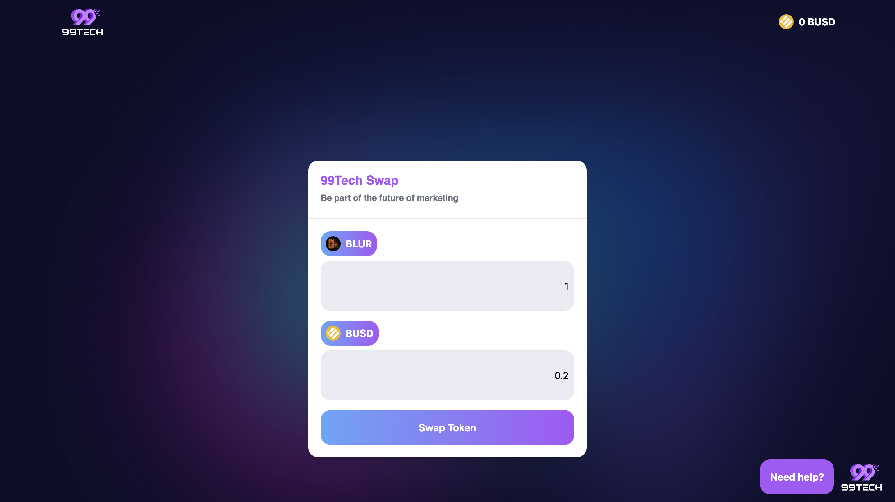

# Currency Swap Project



## Overview

Welcome to the Currency Swap project! This coding challenge, created for Tech 99, demonstrates a feature to swap tokens with exchange rates. I developed this project to showcase my skills and passion for joining Tech 99.

## Decimal Precision

In the field of cryptocurrency, values often have many decimal places. To ensure accurate calculations and display, the application uses 5 decimal places for USD values and cryptocurrency prices. This level of precision is crucial to accurately represent and process small fluctuations in cryptocurrency prices, similar to the precision used by platforms like PancakeSwap. By maintaining high decimal precision, we ensure that users receive the most accurate financial information possible.

### Token Swap Features

**1. Select Token via Modal:**

- Users can select tokens for the transaction through a modal. The modal will display a list of available tokens and allow users to choose from the list.

**2. Display Token Conversion Rate:**

- After selecting tokens, the system will show the conversion rate between the chosen tokens. The conversion rate will be updated instantly and clearly for easy tracking by the user.

**3. Swap Token:**

- When the user performs a swap, the number of tokens will be saved and updated in the system. The interface will display the amount of tokens swapped along with images of the token types.

**4. Get Help Link:**

- To provide additional support, a "Get Help" link will direct users to the [99tech](https://www.99tech.co/) website. This page offers useful information and guidance related to using the token swap application.

## Setup Instructions

1. **Clone the Repository:**

   ```bash
   git clone https://github.com/datmaiq/location-tracking-fe.git
   ```

2. **Navigate to the Project Directory:**

   ```bash
   cd location-tracking-fe
   ```

3. **Install Dependencies:**

   ```bash
   npm install
   ```

4. **Run the Application:**
   ```bash
   npm start
   ```

## Technologies Used

- **Tailwind CSS:** Styling the application.
- **axios:** HTTP client for making API requests.
