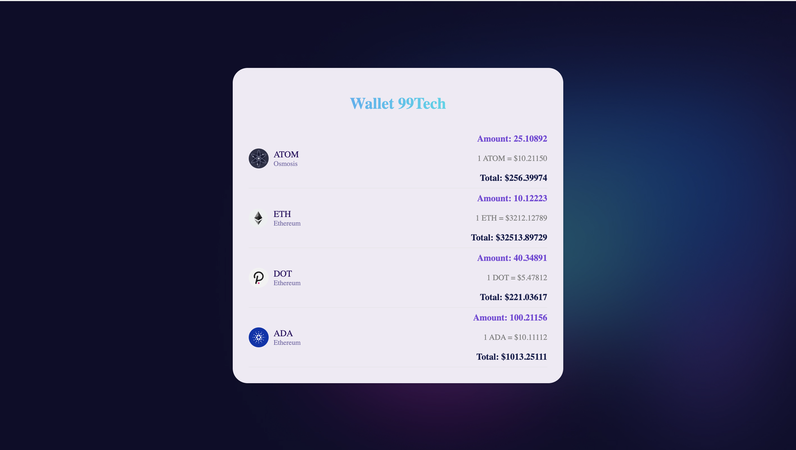

# Wallet Page



## Features

- Displays wallet balances with detailed information about various cryptocurrencies.
- Sorts wallet balances according to blockchain priority.
- Shows the USD value of cryptocurrencies with 5 decimal places of precision.### Issues and Improvements

## Mock Data

Mock data is used to simulate cryptocurrency types and their prices in the application. This helps with development and testing when real API data is not available.

## Decimal Precision

In the field of cryptocurrency, values often have many decimal places. To ensure accurate calculations and display, the application uses 5 decimal places for USD values and cryptocurrency prices. This level of precision is crucial to accurately represent and process small fluctuations in cryptocurrency prices, similar to the precision used by platforms like PancakeSwap. By maintaining high decimal precision, we ensure that users receive the most accurate financial information possible.

#### 1\. Priority Calculation

**Issue:** The `getPriority` function used a switch-case statement to return priority values for different blockchains. This approach was verbose and less maintainable.

**Improvement:** Replaced the switch-case with a map lookup, making the function more concise and easier to update if new blockchains need to be added.

```typescript
const getPriority = (blockchain: string): number => {
  const priorities: { [key: string]: number } = {
    Osmosis: 100,
    Ethereum: 50,
    Arbitrum: 30,
    Zilliqa: 20,
    Neo: 20,
  };
  return priorities[blockchain] ?? -99;
};
```

#### 2\. Dependency Management in `useMemo`

**Issue:** The `useMemo` hook had `prices` as a dependency even though `prices` was not used within the memoized function. This could cause unnecessary re-renders.

**Improvement:** Removed `prices` from the dependencies of `useMemo`.

tsx

```typescript
const sortedBalances = useMemo(() => {
  return balances
    .filter(
      (balance: WalletBalance) =>
        getPriority(balance.blockchain) > -99 && balance.amount > 0
    )
    .sort((a, b) => getPriority(b.blockchain) - getPriority(a.blockchain));
}, [balances]);
```

#### 3\. Formatting Logic

**Issue:** The formatted balances were not memoized, potentially causing unnecessary recalculations and re-renders.

**Improvement:** Added a `useMemo` hook to memoize the formatted balances.

```typescript
`const formattedBalances = useMemo(() => {
 return sortedBalances.map((balance: WalletBalance) => ({
   ...balance,
   formatted: balance.amount.toFixed(2),
 }));
}, [sortedBalances]);`
}, [balances]);
```

#### 4\. Key Prop Handling

**Issue:** The key prop in the map function used the index of the array, which can lead to issues with React's reconciliation process if the list changes.

**Improvement:** Improved the `key` prop by combining `blockchain` and `currency` to ensure uniqueness.

````typescript
const rows = formattedBalances.map((balance: FormattedWalletBalance) => {
  const usdValue = prices[balance.currency] * balance.amount;
  return (
    <WalletRow
      key={`${balance.blockchain}-${balance.currency}`}
      amount={balance.amount}
      usdValue={usdValue}
      formattedAmount={balance.formatted}
    />
  );
});
```bash
````
